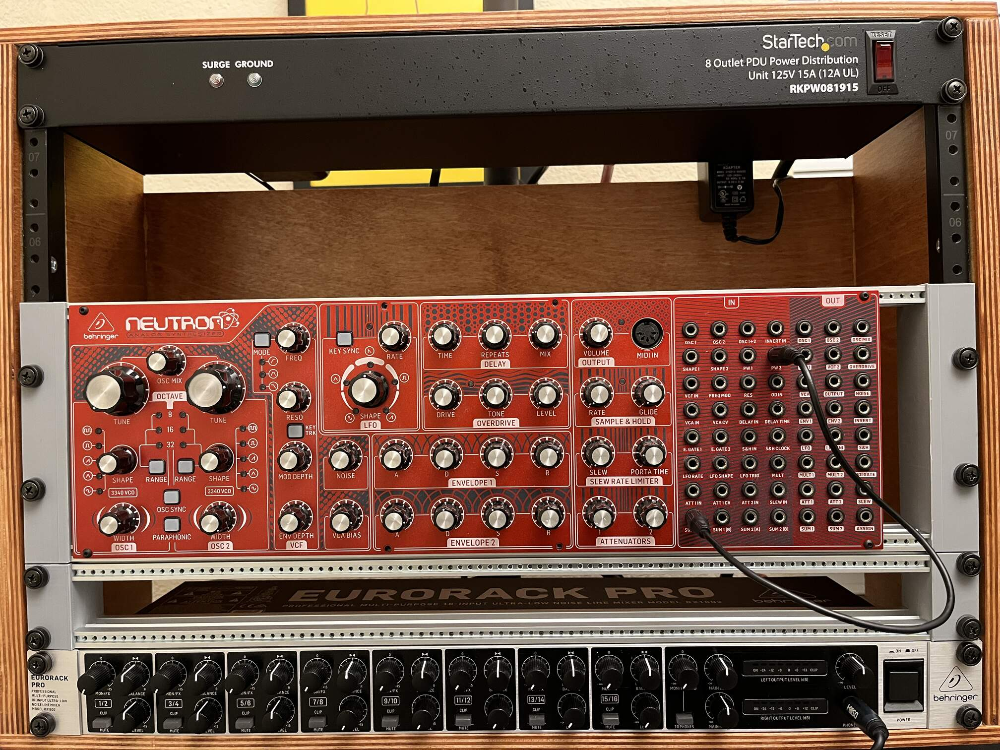

# Eurorack ears for rack mounting
Sketchup models and STL files for 3D printing rack ears to be used with Schroff 84HP rails and installed on a standard 19" rack. 3U and 1U are provided, 1U is untested for proper fit (didn't have any 1U modules at hand), but should work fine.

These rails can be bought at [Digikey](https://www.digikey.com/en/products/detail/schroff/34560584/4210047) and installed into the rack ears using standard M4 screws.

Other sources: [Octopart](https://octopart.com/34560-584-schroff-19007724)

